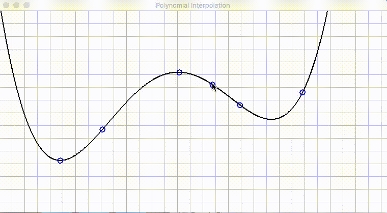

# Lagrange-Interpolation-Demo
<<<<<<< HEAD
A graphical demo of using Newton's Divided Differences to calculate Lagrange polynomials.

I made this gif on my laptop, but the program actually runs seemlessly.

=======
A graphical demo of Newton's Divided Differences to calculate Lagrange polynomials.

Click to add points to the canvas and hold shift to move or delete them.
>>>>>>> origin/master
